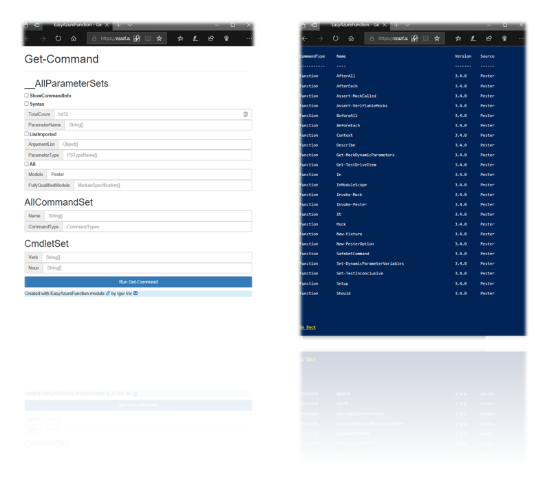
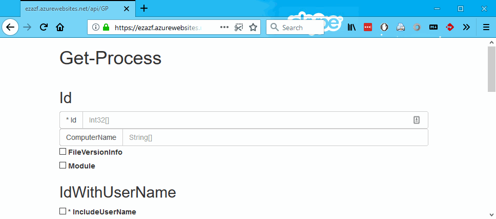

# EasyAzureFunction

[](https://ci.appveyor.com/project/iricigor/easyazurefunction)
[](https://www.powershellgallery.com/packages/EasyAzureFunction)
[](https://www.powershellgallery.com/packages/EasyAzureFunction)

## Introduction

This PowerShell module helps you to create local files for easy start with Azure Functions.
See **How to Use** section below for a quick start.

If you already have your Azure Function created (or you know how to do it), then just run ```New-AzFC <MyCommand>``` and upload generated files to your function! Simple as that!
Command will generate two files:

- **index.html** - simple web page that enables you to enter input values for commandlet parameters (left/first page in screenshots below)
- **run.ps1** - actual script that is executed inside of Azure Function
  - without parameters it returns index.html
  - with parameters, it executes specified command on web server and returns result (right/second page in screenshots below)

Module is tested on both Windows PowerShell and on PowerShell Core.

If you want to learn how PowerShell Azure Function works, check auto-generated run.ps1 files under [Examples](Examples) folders.
For more information on getting started with Azure Functions, check [this introduction page](Examples/AzureFunctions.md).

## How to install

You can install this module from PowerShell Gallery (preferred way) or by cloning GitHub repository.
Module is tested both on Windows PowerShell and PowerShell Core.

### From PSGallery

```PowerShell
Find-Module EasyAzureFunction -Repository PSGallery | Install-Module -Scope CurrentUser -Force
```

### From GitHub

```PowerShell
git clone https://github.com/iricigor/EasyAzureFunction.git      # Clone this repository
Import-Module .\EasyAzureFunction\EasyAzureFunction.psd1 -Force  # Import module
```

## How to use

In order to fully use this module, you need have Azure function and do two simple steps. Azure Function should be HTTP triggered PowerShell function. Check more info [here](Examples/AzureFunctions.md).

### 1. Run command and generate files locally

```PowerShell
 New-AzureFunctionCode -Command Get-Process -Path C:\GP
```

You can select any PowerShell command instead of Get-Process.
You will get two files in folder: run.ps1 and index.html.

### 2. Copy generated files to your Azure function

In AzF you created, replace content of default 'run.ps1' with the one you created.
Under files section (far right), click on Add and create new file named 'index.html' and replace its content also.

Advanced users can do these actions also via FTP.

## Examples

Here are some basic examples for built in PowerShell commands. All of these links will open Azure Functions web page, so just click it and see it in action.

- [Get-Command](https://ezazf.azurewebsites.net/api/GC) - type `Pester` as value for parameter `-Module`
- [Get-Process](https://ezazf.azurewebsites.net/api/GP) - run without any parameters to see all visible processes
- [Get-Module](https://ezazf.azurewebsites.net/api/GM) - select `-ListAvailable` and add `Pester,Dism` in Name field under it

And here are some examples using non-Get functions

- [Write-Output](https://ezazf.azurewebsites.net/api/WO) - try to create 'Hello world!' example
- [Hello-World](https://ezazf.azurewebsites.net/api/HW) - created with -PreCode parameter, see [Examples/HW](Examples/HW) folder
- [Set-ExecutionPolicy](https://ezazf.azurewebsites.net/api/SEP) - shows usage od drop downs in html page, also it helps to understand restrictions on Azure Function environment

### Examples Screenshots




## Known limitations

- Generated html file only supports strings in input fields. If a command expects certain complex object (i.e. PSCredentials, PSSession, etc.), it will fail
- Generated html does only basic parsing of arrays (split on comma), so it might not work always as expected

## Thanks list

- Tobias [@TobiasPSP](https://twitter.com/TobiasPSP) for great and inspiring conference [PSConfEU](http://www.psconf.eu/) 2018
- Sergei [@xvorsx](https://twitter.com/xvorsx) for nice introduction to [PlatyPS](https://github.com/PowerShell/platyPS)
- Jakub [@nohwnd](https://github.com/nohwnd) for great testing framework [Pester](https://github.com/pester/Pester)
- Aleksandar [@alexandair](https://twitter.com/alexandair) - for great social component at the PSConfEU conference
- [The PowerShell team](https://twitter.com/PowerShell_Team) *(Joey, Steve and others)* - for great product!
